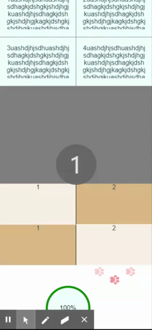

# CSS 实现百分比环形



### 圆环构成

整个环有一大一小两个圆组成，内层较小的作为遮盖层，利用颜色不同遮住较大的圆，从而构成一个环。
`background-image`属性和` linear-gradient()`来控制颜色。
第一个`linear-gradient()`函数生成的背景图像上面灰色，下面透明，旋转 90deg 后，右边灰色，左边透明显示本色；
第二个`linear-gradient()`的作用相反，所以此时整个环显示的是灰色。

```html
<div class="percent-circle">
  <!--外圈-->
  <div id="circle" class="circle-border">
    <!--内圈-->
    <div class="circle" id="circle-text"></div>
  </div>
</div>
```

```css
//less
.percent-circle {
  .circle {
    position: relative;
    top: 5px;
    left: 5px;
    color: black;
    text-align: center;
    width: 100px;
    height: 100px;
    line-height: 100px;
    border-radius: 100%;
    background-color: azure;
  }

  .circle-border {
    position: relative;
    text-align: center;
    width: 110px;
    height: 110px;
    margin-left: 30%;
    border-radius: 100%;
    background-color: green;
    background-image: linear-gradient(
        90deg,
        transparent 50%,
        rgb(197, 207, 207) 50%
      ), linear-gradient(90deg, rgb(192, 206, 206) 50%, transparent 50%);
  }
}
```

### 改变百分比状态

js 将第一个` linear-gradient()`创造的背景旋转，灰色部分逐渐左移与第二个重合，其透明部分逐渐将圆的本色显示出来。
当其透明部分完全转出来的时候，将它复位为初始状态，同时将灰色部分替换为圆的本色，再次旋转就会逐渐覆盖掉第二个的灰色。

从始至终只有第一个` linear-gradient()`的背景图像在变化，第二个只是作为遮盖。

```js
let i = 0,
  id,
  c = document.getElementById('circle'),
  ct = document.getElementById('circle-text')
let fun = function () {
  if (i > 360) {
    cancelAnimationFrame(id)
    return
  }
  if (i < 180)
    c.style.backgroundImage =
      'linear-gradient(' +
      (90 + i) +
      'deg, transparent 50%, rgb(192, 206, 206) 50%),linear-gradient(90deg, rgb(192, 206, 206) 50%, transparent 50%)'
  else
    c.style.backgroundImage =
      'linear-gradient(' +
      (i - 90) +
      'deg, transparent 50%, green 50%),linear-gradient(90deg, rgb(192, 206, 206) 50%, transparent 50%)'
  i++
  ct.textContent = parseInt(i / 3.6) + '%'
  id = window.requestAnimationFrame(fun)
}
fun()
```
